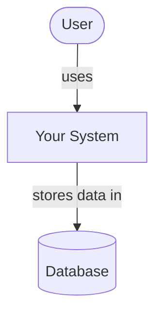
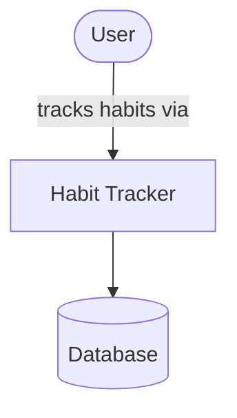
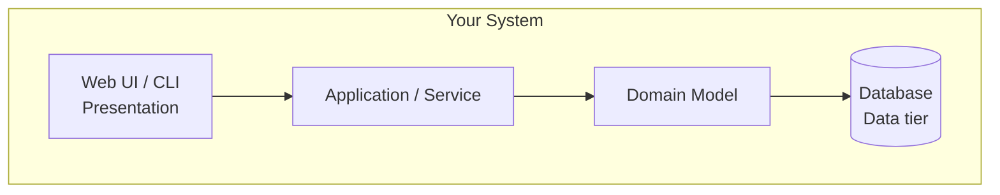
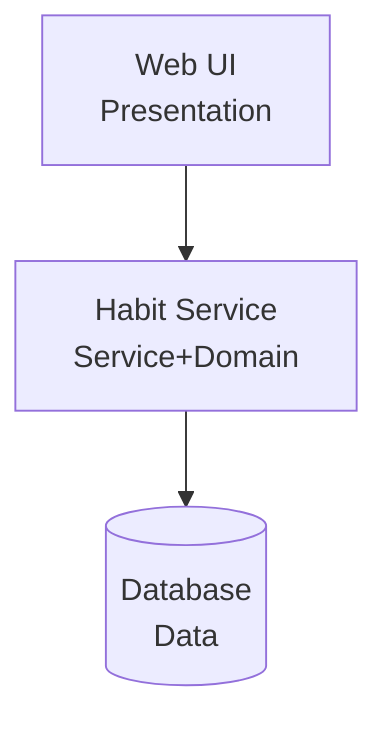
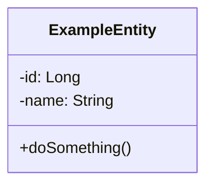
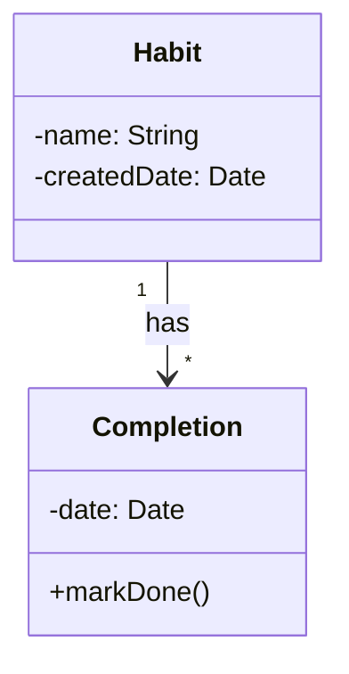
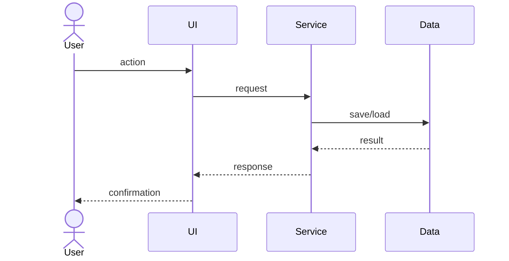

# [Your Project Name]

<!-- CI badge: after Session 4, replace ORG/REPO and the workflow filename, then uncomment:

-->

**Student:** [Kiavash Bahreini] · **Course:** CEN 5064 Software Design, Fall 2026 · **Partner:** [@KiavashBahreini7]

## Project (approval paragraph — write this by Sun Aug 30)

[One paragraph: What is the system? Who is it for? What are its 3–4 core features?
This paragraph is your approval request — see the Project Brief, Section 2.]

A simple habit tracker where users log daily habits and see a streak count. Core features: add a habit, mark it done today, view a 7-day streak, delete a habit.

- [x] Started work on Add a habit (issue #1)

## How to run

```
[Exact commands to build and run your system from a clean clone.
Update this every time the steps change — your partner and your
instructor will follow it literally on conference days.]
```

## Architecture

### Tier breakdown (Session 2 studio)

| Tier | Responsibilities in THIS system |
|------|--------------------------------|
| Presentation | [what your UI layer does] Web page showing today's habits with checkboxes; a form to add a new habit; a streak display|
| Service | [what your use-case/orchestration layer does] markDone(habitId): checks the habit exists, records today's completion, recalculates the streak|
| Domain | [your entities and business rules] Habit (name, created date), Completion (habit, date) — rule: "a habit can only be marked done once per day"|
| Data | [how and where data is stored] Stores habits and completions in a database, behind a HabitRepository interface|

### C4 — Context & Container (Session 3 studio)









### UML — Class & Sequence (Session 3 studio)







## Architecture Decision Records

Decisions live in [`docs/adr/`](docs/adr/). Start with ADR-001 in Session 4.

| # | Decision | Status |
|---|----------|--------|
| [001](docs/adr/adr-001.md) | [What I am building and why] | [proposed] |

## Weekly log (optional but recommended)

A one-line note per week keeps your commit story readable:

- Week 1 (Aug 24): repo created, three ideas drafted
- Week 2 (Aug 31): ...
